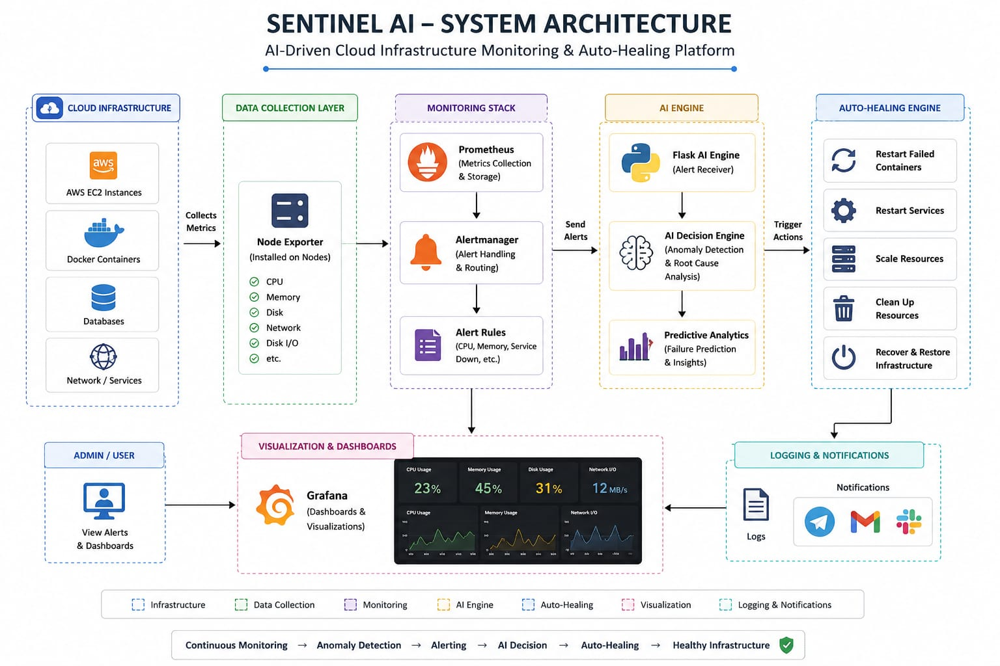
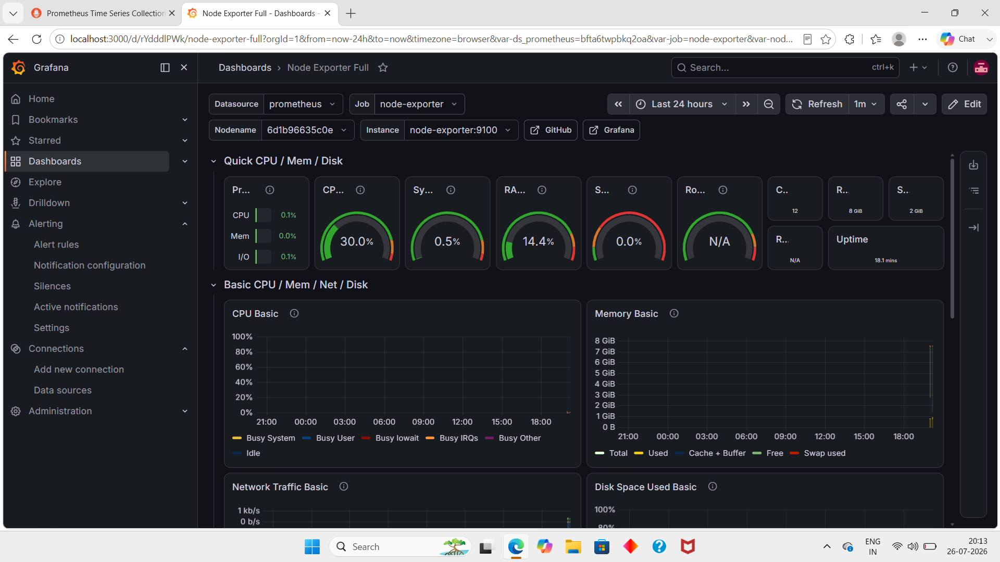
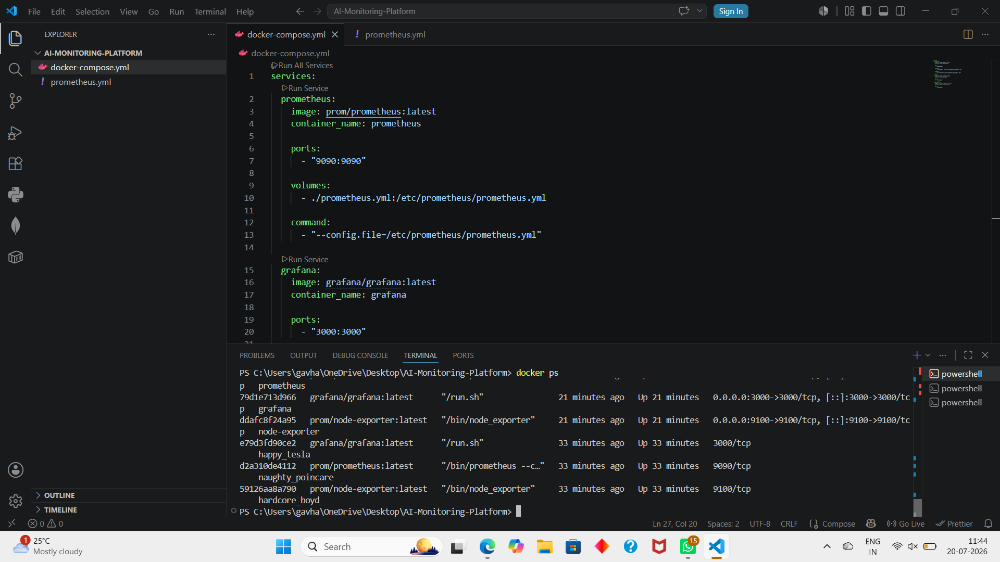

# 🚀 Sentinel AI

### AI-Driven Cloud Infrastructure Monitoring & Auto-Healing Platform

Sentinel AI is an intelligent cloud infrastructure monitoring and auto-healing platform that leverages Artificial Intelligence, Cloud Computing, DevOps, and Data Science to monitor cloud resources, detect anomalies, generate alerts, and automatically recover failed services with minimal human intervention.

---

# 📖 Project Overview

Modern cloud environments require continuous monitoring to ensure high availability and reliability. Traditional monitoring systems generate alerts but still depend on manual intervention to resolve issues.

Sentinel AI addresses this challenge by integrating AI-driven monitoring with automated recovery. The platform continuously collects infrastructure metrics, analyzes system health, detects anomalies, predicts failures, and performs intelligent auto-healing actions to minimize downtime and improve operational efficiency.

---

# ✨ Key Features

- 📊 Real-Time Infrastructure Monitoring
- 🤖 AI-Based Anomaly Detection
- 📈 Predictive Analytics
- 🔔 Intelligent Alert Management
- ⚡ Automated Auto-Healing
- 🐳 Docker Container Monitoring
- 📉 Grafana Dashboards
- 📡 Prometheus Metrics Collection
- 🚀 AWS Cloud Ready
- 🔄 Flask-Based AI Decision Engine

---

# 🏗️ System Architecture

```
Cloud Infrastructure
        │
        ▼
Node Exporter
        │
        ▼
Prometheus
        │
        ▼
Alert Rules
        │
        ▼
Alertmanager
        │
        ▼
Flask AI Engine
        │
        ▼
AI Decision Engine
        │
        ▼
Auto-Healing Engine
        │
        ▼
Restart Failed Services
        │
        ▼
Grafana Dashboard
```

---
## 🏗️ System Architecture


# 🛠️ Technology Stack

## Cloud
- AWS

## DevOps
- Docker
- Docker Compose

## Monitoring
- Prometheus
- Grafana
- Alertmanager
- Node Exporter

## Backend
- Python
- Flask

## Data Science
- Predictive Analytics
- AI-Based Anomaly Detection

## Version Control
- Git
- GitHub

---

# 📂 Project Structure

```
Sentinel-AI
│
├── docker-compose.yml
├── prometheus.yml
├── alertmanager.yml
├── rules.yml
├── ai_engine.py
├── requirements.txt
├── README.md
├── architecture/
├── docs

---

## 📸 Project Screenshots

### Grafana Dashboard


### Prometheus Targets


### Docker Containers


### AI Engine


